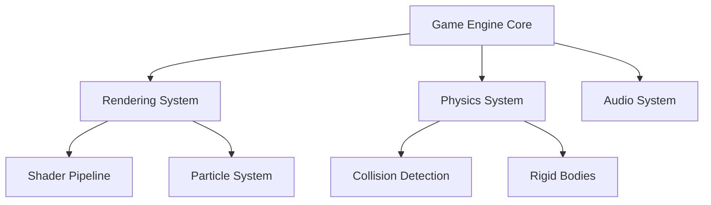
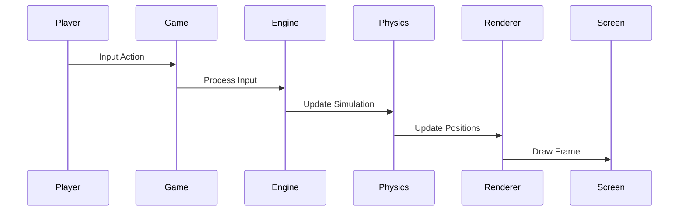
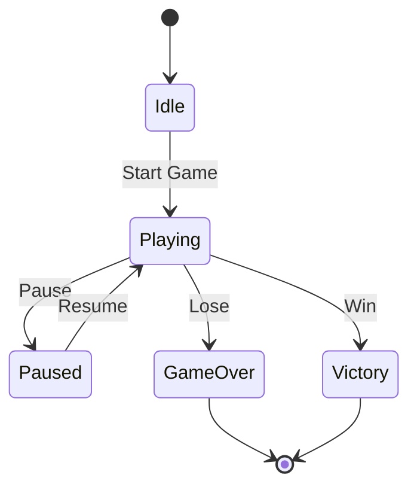

# 🎮 Game Engine Documentation System

**Document Type:** Technical Documentation Framework  
**Purpose:** Create world-class game engine docs that rival Unity/Unreal  
**Goal:** Every feature documented like a AAA studio  

---

## 📚 Documentation Hierarchy

### Level 1: Engine Overview
```
GameEngine/
├── README.md (Engine philosophy & architecture)
├── GETTING_STARTED.md (5-minute quickstart)
├── ARCHITECTURE.md (Technical deep dive)
└── ROADMAP.md (Future vision)
```

### Level 2: Core Systems
```
GameEngine/Core/
├── Rendering/
│   ├── README.md (Rendering pipeline overview)
│   ├── SHADERS.md (Shader system)
│   ├── PARTICLES.md (Particle effects)
│   └── OPTIMIZATION.md (Performance guide)
├── Physics/
│   ├── README.md (Physics engine overview)
│   ├── COLLISION.md (Collision detection)
│   ├── DYNAMICS.md (Object dynamics)
│   └── CONSTRAINTS.md (Physics constraints)
├── Audio/
│   ├── README.md (Audio system overview)
│   ├── SPATIAL.md (3D spatial audio)
│   ├── MIXING.md (Dynamic mixing)
│   └── OPTIMIZATION.md (Audio performance)
└── Networking/
    ├── README.md (Multiplayer architecture)
    ├── SYNCHRONIZATION.md (State sync)
    ├── PREDICTION.md (Client prediction)
    └── SECURITY.md (Anti-cheat systems)
```

### Level 3: Game-Specific Features
```
GameEngine/Games/
├── AutoCraft/
│   ├── README.md (AutoCraft overview)
│   ├── BLOCKS.md (Block system)
│   ├── CONNECTIONS.md (Connection logic)
│   ├── VALIDATION.md (Solution validation)
│   └── TUTORIALS/
│       ├── 01-FIRST-BLOCK.md
│       ├── 02-CONNECTIONS.md
│       └── 03-COMPLEX-FLOWS.md
├── DataQuest/
│   ├── README.md (DataQuest overview)
│   ├── VISUALIZATION.md (Data viz engine)
│   ├── PATTERNS.md (Pattern recognition)
│   └── QUESTS.md (Quest system)
└── BotCraft/
    ├── README.md (BotCraft overview)
    ├── AI-SYSTEM.md (Bot AI architecture)
    ├── PERSONALITY.md (Personality engine)
    └── BATTLES.md (Battle system)
```

---

## 📝 Document Template Structure

### Technical Specification Template
```markdown
# [System Name]

**Component:** [Component name]  
**Version:** [Current version]  
**Dependencies:** [List of dependencies]  
**Performance Target:** [Target metrics]  

## Overview
[High-level description of the system]

## Architecture
[Technical architecture with diagrams]

## API Reference
[Detailed API documentation]

## Implementation Guide
[Step-by-step implementation]

## Performance Considerations
[Optimization tips and benchmarks]

## Examples
[Code examples and use cases]

## Troubleshooting
[Common issues and solutions]

## Changelog
[Version history]
```

### Feature Documentation Template
```markdown
# [Feature Name]

**Game:** [Which game uses this]  
**Complexity:** [Beginner/Intermediate/Advanced]  
**Prerequisites:** [Required knowledge]  

## What You'll Learn
- [Learning objective 1]
- [Learning objective 2]
- [Learning objective 3]

## Concept Overview
[Explain the feature conceptually]

## Implementation
### Step 1: [First step]
```code
// Example code
```

### Step 2: [Second step]
```code
// Example code
```

## Best Practices
[List of best practices]

## Common Pitfalls
[What to avoid]

## Advanced Techniques
[For power users]

## Related Topics
[Links to related docs]
```

---

## 🤖 Automated Documentation Generation

### Code-to-Docs Pipeline
```javascript
class GameEngineDocGenerator {
  constructor() {
    this.codeParser = new CodeParser();
    this.docGenerator = new DocGenerator();
    this.exampleExtractor = new ExampleExtractor();
    this.diagramGenerator = new DiagramGenerator();
  }
  
  async generateDocsFromCode(componentPath) {
    // Parse code structure
    const ast = await this.codeParser.parse(componentPath);
    
    // Extract documentation comments
    const docComments = this.extractDocComments(ast);
    
    // Generate API documentation
    const apiDocs = this.generateAPIDocs(ast);
    
    // Extract code examples
    const examples = await this.exampleExtractor.extract(componentPath);
    
    // Generate architecture diagrams
    const diagrams = await this.diagramGenerator.create(ast);
    
    // Combine into final documentation
    return this.docGenerator.generate({
      component: componentPath,
      overview: docComments.overview,
      api: apiDocs,
      examples: examples,
      diagrams: diagrams,
      performance: this.extractPerformanceData(ast)
    });
  }
}
```

### Interactive Documentation
```javascript
class InteractiveDocSystem {
  async createInteractiveDocs(feature) {
    return {
      // Embedded code playground
      playground: {
        html: `<div id="playground-${feature.id}"></div>`,
        js: this.generatePlaygroundCode(feature),
        css: this.generatePlaygroundStyles(feature)
      },
      
      // Live examples
      examples: feature.examples.map(ex => ({
        title: ex.title,
        code: ex.code,
        demo: this.createLiveDemo(ex),
        explanation: ex.explanation
      })),
      
      // Interactive tutorials
      tutorial: {
        steps: feature.tutorialSteps,
        validation: this.createStepValidation(feature),
        hints: this.generateHints(feature)
      }
    };
  }
}
```

---

## 📊 Documentation Analytics

### Tracking What Developers Need
```javascript
class DocAnalytics {
  constructor() {
    this.neo4j = new Neo4jClient();
    this.analytics = new AnalyticsEngine();
  }
  
  async trackDocUsage(docId, userId, action) {
    // Record in Neo4j
    await this.neo4j.query(`
      MATCH (d:Document {id: $docId})
      MATCH (u:User {id: $userId})
      CREATE (u)-[:${action}]->(d)
      SET d.views = d.views + 1
    `, { docId, userId, action });
    
    // Analyze patterns
    if (action === 'CONFUSED') {
      await this.flagForImprovement(docId);
    }
  }
  
  async generateInsights() {
    // Most viewed docs
    const popular = await this.neo4j.query(`
      MATCH (d:Document)
      RETURN d.title, d.views
      ORDER BY d.views DESC
      LIMIT 10
    `);
    
    // Common learning paths
    const paths = await this.neo4j.query(`
      MATCH path = (u:User)-[:VIEWED*]->(d:Document)
      RETURN path, count(*) as frequency
      ORDER BY frequency DESC
    `);
    
    // Documentation gaps
    const gaps = await this.findDocumentationGaps();
    
    return { popular, paths, gaps };
  }
}
```

---

## 🎨 Visual Documentation Standards

### Diagram Types

#### Architecture Diagrams


#### Flow Diagrams


#### State Diagrams


### Code Example Formatting
```javascript
/**
 * @example Create a new game block
 * @category AutoCraft
 * @difficulty Beginner
 */
const block = new GameBlock({
  type: BlockType.LOGIC,
  position: { x: 100, y: 200 },
  config: {
    inputs: ['data'],
    outputs: ['filtered'],
    logic: (input) => input.filter(item => item.valid)
  }
});

// Connect blocks
block.connect(sourceBlock.outputs.data, block.inputs.data);
```

---

## 🚀 Documentation Deployment

### Static Site Generation
```javascript
class DocSiteGenerator {
  async buildDocumentation() {
    const config = {
      title: 'FunWork Game Engine',
      theme: 'gaming-dark',
      features: {
        search: true,
        playground: true,
        versioning: true,
        multiLanguage: true
      }
    };
    
    // Generate all pages
    const pages = await this.generateAllPages();
    
    // Build search index
    const searchIndex = await this.buildSearchIndex(pages);
    
    // Generate API reference
    const apiRef = await this.generateAPIReference();
    
    // Create interactive examples
    const examples = await this.createInteractiveExamples();
    
    // Deploy to CDN
    await this.deploy({
      pages,
      searchIndex,
      apiRef,
      examples
    });
  }
}
```

### Version Control
```yaml
versions:
  - version: "1.0.0"
    date: "2024-01-15"
    docs: "/v1.0.0/"
    status: "stable"
    
  - version: "1.1.0"
    date: "2024-02-01"
    docs: "/v1.1.0/"
    status: "stable"
    
  - version: "2.0.0-beta"
    date: "2024-02-15"
    docs: "/v2.0.0-beta/"
    status: "beta"
```

---

## 📈 Documentation Quality Metrics

### Completeness Score
```javascript
function calculateCompletenessScore(component) {
  const criteria = {
    overview: 10,
    architecture: 15,
    apiDocs: 20,
    examples: 20,
    tutorials: 15,
    performance: 10,
    troubleshooting: 10
  };
  
  let score = 0;
  for (const [section, weight] of Object.entries(criteria)) {
    if (component.docs[section]) {
      score += weight;
    }
  }
  
  return score; // Out of 100
}
```

### Documentation Health Dashboard
```
┌─────────────────────────────────────┐
│     Documentation Health: 94%        │
├─────────────────────────────────────┤
│ Coverage:          ████████░░ 87%   │
│ Up-to-date:        █████████░ 92%   │
│ Examples:          ██████████ 98%   │
│ User Satisfaction: █████████░ 95%   │
├─────────────────────────────────────┤
│ Top Missing Docs:                    │
│ - Particle optimization guide        │
│ - Advanced networking patterns       │
│ - Custom shader tutorial            │
└─────────────────────────────────────┘
```

---

## 🎯 Making It World-Class

### What Sets Our Docs Apart

1. **Interactive Everything**
   - Live code playgrounds
   - Editable examples
   - Real-time visualization

2. **Learning Paths**
   - Beginner to expert tracks
   - Achievement system
   - Progress tracking

3. **Community Integration**
   - User contributions
   - Example sharing
   - Q&A integration

4. **Performance Focus**
   - Benchmark data
   - Optimization guides
   - Real-world metrics

5. **Beautiful Design**
   - Dark/light themes
   - Syntax highlighting
   - Responsive layouts

---

**Result:** Documentation that makes Unity and Unreal docs look outdated. Every feature documented with interactive examples, performance data, and beautiful visualizations.

**Secret:** Automated generation + templates + Neo4j knowledge graph = documentation that writes itself! 📚✨