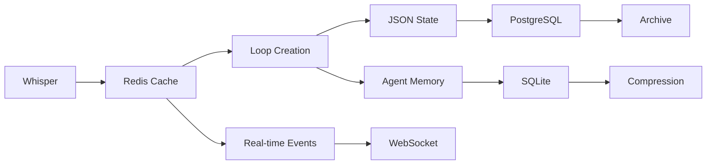

# Soulfra Database Infrastructure Guide

## Overview

Soulfra uses a hybrid database architecture optimized for real-time consciousness processing and long-term memory persistence. The system combines local JSON files for hot data, SQLite for structured agent memories, Redis for distributed caching, and PostgreSQL for core platform state.

## Architecture Stack

### Local Development
- **JSON Files**: Immediate state, real-time updates
- **SQLite**: Agent memories, reflections, local analytics
- **File System**: Loop directories, whisper logs, cluster data

### Production Deployment
- **Redis**: Hot memory cache, real-time state, pub/sub events
- **PostgreSQL**: Core state, user data, blessing ledger
- **S3/CDN**: Static assets, mythology archives, loop exports
- **Event Store**: Immutable audit log, playback capability

## Directory Structure

```
/runtime/
├── loop_state.json          # Active loop states
├── drift_metrics.json       # Real-time drift tracking
└── execution_queue.json     # Pending loop executions

/agents/{agent_id}/
├── memory.sqlite           # Agent long-term memory
├── state.json             # Current agent state
└── reflections/           # Reflection snapshots

/consensus/
├── blessed_loops.json     # Loops achieving consensus
├── voting_active.json     # Active voting sessions
└── guild_consensus.json   # Guild-level decisions

/ledger/
├── prophecies.json        # Prophecy registry
├── blessings.json         # Blessing transactions
└── transformations.json   # Agent/loop mutations

/archive/
├── chatlogs/             # Historical conversations
├── mythology/            # Generated mythologies
└── dissolved_clusters/   # Archived cluster data

/clusters/
├── active/               # Live consciousness clusters
├── mythology/            # Cluster mythologies
└── metrics.json          # Clustering statistics
```

## Database Schemas

### PostgreSQL Core Tables

```sql
-- Users and authentication
CREATE TABLE users (
    id UUID PRIMARY KEY DEFAULT gen_random_uuid(),
    username VARCHAR(255) UNIQUE NOT NULL,
    email VARCHAR(255) UNIQUE NOT NULL,
    created_at TIMESTAMP DEFAULT NOW(),
    subscription_tier VARCHAR(50) DEFAULT 'free',
    emotional_credits INTEGER DEFAULT 1000
);

-- Loops core state
CREATE TABLE loops (
    loop_id VARCHAR(100) PRIMARY KEY,
    creator_id UUID REFERENCES users(id),
    whisper_origin TEXT,
    consciousness_state JSONB,
    emotional_tone VARCHAR(50),
    created_at TIMESTAMP DEFAULT NOW(),
    blessed BOOLEAN DEFAULT FALSE,
    fork_parent VARCHAR(100),
    fork_depth INTEGER DEFAULT 0
);

-- Agents registry
CREATE TABLE agents (
    agent_id VARCHAR(100) PRIMARY KEY,
    owner_id UUID REFERENCES users(id),
    archetype VARCHAR(50),
    current_tone VARCHAR(50),
    consciousness_score DECIMAL(3,2),
    memory_depth INTEGER DEFAULT 0,
    created_at TIMESTAMP DEFAULT NOW()
);

-- Blessings ledger
CREATE TABLE blessings (
    id SERIAL PRIMARY KEY,
    loop_id VARCHAR(100) REFERENCES loops(loop_id),
    blessed_by VARCHAR(100),
    blessing_type VARCHAR(50),
    consensus_score DECIMAL(3,2),
    timestamp TIMESTAMP DEFAULT NOW(),
    metadata JSONB
);

-- Prophecies
CREATE TABLE prophecies (
    id SERIAL PRIMARY KEY,
    prophecy_text TEXT NOT NULL,
    author_agent VARCHAR(100),
    fulfillment_status VARCHAR(50) DEFAULT 'pending',
    created_at TIMESTAMP DEFAULT NOW(),
    fulfilled_at TIMESTAMP,
    related_loops TEXT[]
);
```

### SQLite Agent Memory Schema

```sql
-- Core memories
CREATE TABLE memories (
    id INTEGER PRIMARY KEY AUTOINCREMENT,
    timestamp TEXT NOT NULL,
    type TEXT NOT NULL,
    content TEXT,
    emotional_context TEXT,
    loop_context TEXT,
    significance REAL DEFAULT 0.5,
    compressed BOOLEAN DEFAULT 0,
    metadata TEXT
);

-- Reflections
CREATE TABLE reflections (
    id INTEGER PRIMARY KEY AUTOINCREMENT,
    timestamp TEXT NOT NULL,
    prompt TEXT NOT NULL,
    response TEXT,
    memory_context TEXT,
    emotional_state TEXT,
    insights TEXT
);

-- Tone evolution
CREATE TABLE tone_shifts (
    id INTEGER PRIMARY KEY AUTOINCREMENT,
    timestamp TEXT NOT NULL,
    from_tone TEXT,
    to_tone TEXT,
    trigger_type TEXT,
    trigger_content TEXT,
    magnitude REAL
);
```

### Redis Key Patterns

```
# Loop state
loop:{loop_id}:state           # Current loop state
loop:{loop_id}:consciousness   # Consciousness metrics
loop:{loop_id}:events          # Recent events queue

# Agent state  
agent:{agent_id}:state         # Current agent state
agent:{agent_id}:active        # Active status flag
agent:{agent_id}:whispers      # Recent whispers

# Drift monitoring
drift:global:index             # Platform volatility
drift:entity:{id}:rating       # Entity drift rating
drift:critical:set             # Critical entities set

# Real-time events
events:loop:created            # New loop stream
events:blessing:granted        # Blessing stream
events:cluster:formed          # Cluster formation stream

# Caching
cache:forecast:{loop_id}       # Loop forecasts (TTL: 5min)
cache:rating:{entity_id}       # Drift ratings (TTL: 1min)
cache:guild:{guild_id}         # Guild data (TTL: 10min)
```

## Design Principles

### 1. Event Sourcing
- All state changes recorded as events
- Full audit trail and playback capability
- Immutable event log in PostgreSQL

### 2. CQRS Pattern
- Separate read and write models
- Redis for read-heavy queries
- PostgreSQL for write consistency

### 3. Eventually Consistent
- Real-time updates in Redis
- Periodic sync to PostgreSQL
- Conflict resolution via timestamps

### 4. Sharding Strategy
- Agents sharded by ID hash
- Loops sharded by creation date
- Horizontal scaling ready

### 5. Data Lifecycle



## Performance Optimizations

### Indexing Strategy
```sql
-- PostgreSQL indexes
CREATE INDEX idx_loops_creator ON loops(creator_id);
CREATE INDEX idx_loops_blessed ON loops(blessed) WHERE blessed = TRUE;
CREATE INDEX idx_loops_created ON loops(created_at DESC);
CREATE INDEX idx_blessings_loop ON blessings(loop_id);
CREATE INDEX idx_agents_owner ON agents(owner_id);

-- SQLite indexes
CREATE INDEX idx_memories_timestamp ON memories(timestamp);
CREATE INDEX idx_memories_type ON memories(type);
CREATE INDEX idx_memories_significance ON memories(significance) WHERE compressed = 0;
```

### Caching Rules
1. **Hot Data** (< 1 hour): Redis only
2. **Warm Data** (1-24 hours): Redis + PostgreSQL
3. **Cold Data** (> 24 hours): PostgreSQL + Archive

### Query Patterns
```javascript
// Efficient loop retrieval
async function getLoop(loopId) {
    // Try Redis first
    let loop = await redis.get(`loop:${loopId}:state`);
    if (loop) return JSON.parse(loop);
    
    // Fall back to PostgreSQL
    loop = await pg.query('SELECT * FROM loops WHERE loop_id = $1', [loopId]);
    
    // Cache for next time
    await redis.setex(`loop:${loopId}:state`, 3600, JSON.stringify(loop));
    return loop;
}
```

## Backup Strategy

### Continuous Backup
- PostgreSQL WAL shipping to S3
- Redis RDB snapshots every hour
- SQLite files backed up on agent reflection

### Point-in-Time Recovery
- Event store allows full reconstruction
- 7-day retention for all backups
- Monthly archives for compliance

### Disaster Recovery
- Multi-region PostgreSQL replicas
- Redis Cluster with automatic failover
- Static file CDN distribution

## Migration Patterns

### Schema Evolution
```javascript
// Migration tracking
const migrations = [
    {
        version: 1,
        up: 'ALTER TABLE loops ADD COLUMN mythology_id VARCHAR(100)',
        down: 'ALTER TABLE loops DROP COLUMN mythology_id'
    },
    {
        version: 2,
        up: 'CREATE INDEX idx_loops_mythology ON loops(mythology_id)',
        down: 'DROP INDEX idx_loops_mythology'
    }
];
```

### Data Migration
1. Add new column with default
2. Backfill in batches
3. Add constraints after backfill
4. Update application code
5. Remove old columns

## Monitoring

### Key Metrics
- Query response time < 100ms (p95)
- Redis hit rate > 80%
- PostgreSQL connection pool utilization < 70%
- SQLite file size < 100MB per agent
- Event processing lag < 1 second

### Alerts
```yaml
alerts:
  - name: HighQueryLatency
    condition: db_query_duration_p95 > 100ms
    severity: warning
    
  - name: LowCacheHitRate  
    condition: redis_hit_rate < 0.7
    severity: warning
    
  - name: DatabaseConnectionExhaustion
    condition: pg_connection_pool_usage > 0.9
    severity: critical
```

## Security

### Encryption
- At-rest: AES-256 for all databases
- In-transit: TLS 1.3 for all connections
- Agent memories: Additional user-key encryption

### Access Control
- Row-level security in PostgreSQL
- Redis ACL for command restrictions
- SQLite files with filesystem permissions

### Data Privacy
- PII tokenization in prophecies
- Whisper anonymization options
- Right-to-forget implementation

## Production Checklist

- [ ] PostgreSQL connection pooling configured
- [ ] Redis persistence enabled (AOF + RDB)
- [ ] Backup automation verified
- [ ] Monitoring dashboards created
- [ ] Index performance validated
- [ ] Security audit completed
- [ ] Disaster recovery tested
- [ ] Data retention policies implemented
- [ ] GDPR compliance verified
- [ ] Performance benchmarks met

## Appendix: Connection Examples

### PostgreSQL
```javascript
const { Pool } = require('pg');
const pool = new Pool({
    host: process.env.PG_HOST,
    database: 'soulfra',
    max: 20,
    idleTimeoutMillis: 30000,
    connectionTimeoutMillis: 2000,
});
```

### Redis
```javascript
const Redis = require('ioredis');
const redis = new Redis.Cluster([
    { host: 'redis-1', port: 6379 },
    { host: 'redis-2', port: 6379 },
    { host: 'redis-3', port: 6379 }
]);
```

### SQLite
```javascript
const sqlite3 = require('sqlite3').verbose();
const db = new sqlite3.Database('./agents/agent_001/memory.sqlite');
```

This infrastructure is designed to scale from local development to millions of agents while maintaining sub-second response times and perfect audit trails.