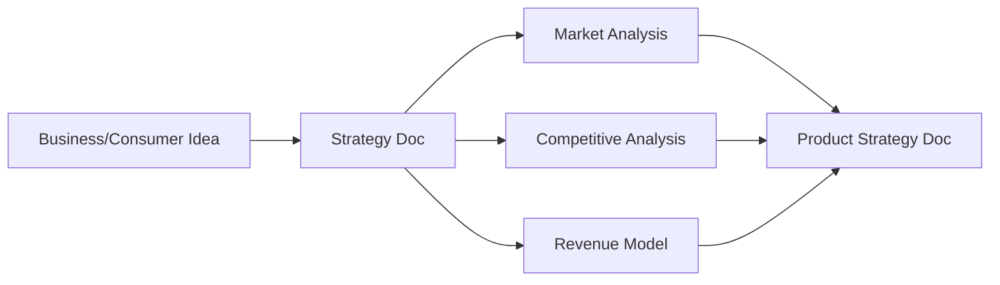
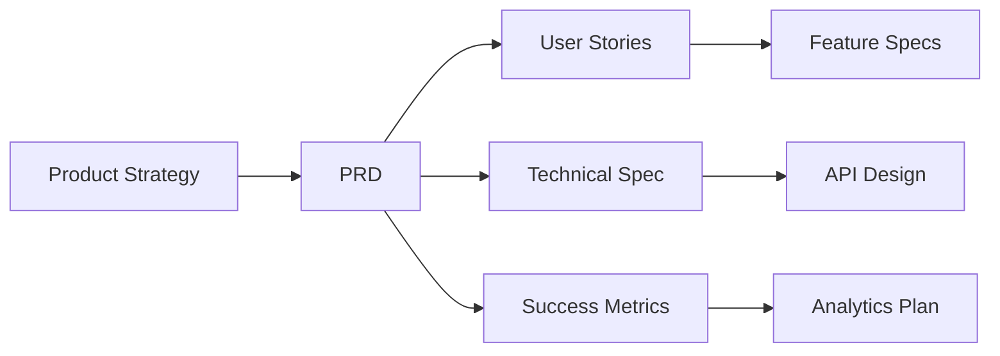
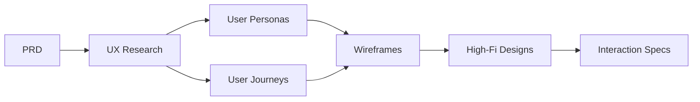
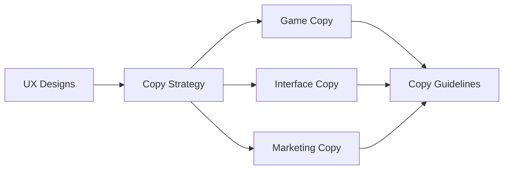
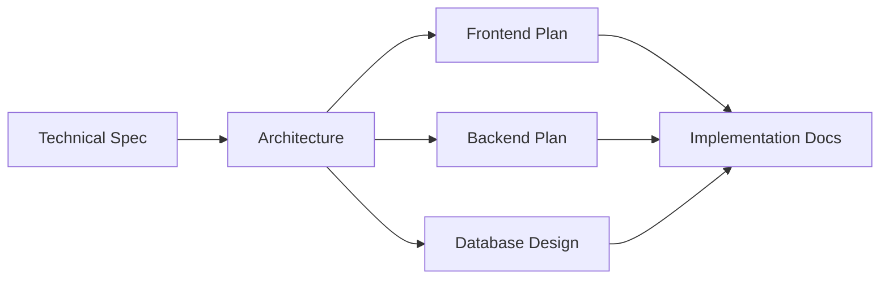
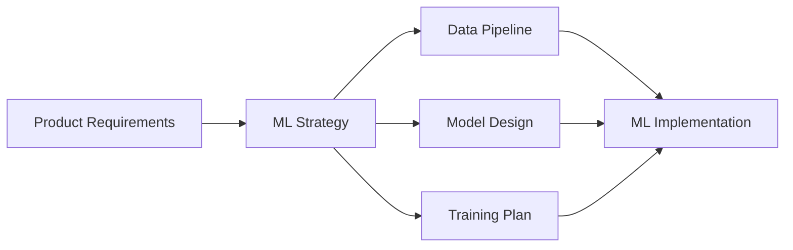

# 🏢 Team Structure & Documentation Flow

**Document Type:** Organizational Blueprint  
**Purpose:** Define how a "50-person team" creates world-class documentation  
**Reality:** It's just you, but the output looks enterprise-grade  

---

## 🎯 Virtual Team Structure

### Executive Layer
```
CEO (You)
├── CTO - Technical Vision
├── CPO - Product Strategy  
├── CMO - Marketing & Growth
└── CFO - Revenue & Monetization
```

### Product Organization
```
CPO
├── Product Managers (3)
│   ├── PM - Gaming Products
│   ├── PM - Business Tools
│   └── PM - Platform Infrastructure
├── UX Team (5)
│   ├── UX Research Lead
│   ├── UX Designer - Games
│   ├── UX Designer - Business
│   ├── UI Designer
│   └── Interaction Designer
└── Game Design Team (4)
    ├── Lead Game Designer
    ├── Level Designer
    ├── Economy Designer
    └── Narrative Designer
```

### Engineering Organization
```
CTO
├── Frontend Team (6)
│   ├── Frontend Lead
│   ├── React Engineers (3)
│   ├── Mobile Engineer
│   └── WebGL/Canvas Specialist
├── Backend Team (8)
│   ├── Backend Lead
│   ├── API Engineers (3)
│   ├── Infrastructure Engineers (2)
│   ├── Payment Systems Engineer
│   └── Security Engineer
├── ML/AI Team (5)
│   ├── ML Lead
│   ├── NLP Engineer
│   ├── Recommendation Systems
│   ├── Computer Vision
│   └── MLOps Engineer
└── DevOps Team (4)
    ├── DevOps Lead
    ├── Cloud Architect
    ├── SRE
    └── Database Administrator
```

### Growth & Operations
```
CMO
├── Content Team (3)
│   ├── Content Strategy Lead
│   ├── Copywriter - Games
│   └── Copywriter - Business
├── Growth Team (3)
│   ├── Growth Lead
│   ├── Performance Marketing
│   └── Viral/Social Manager
└── Analytics Team (2)
    ├── Data Analyst
    └── Business Intelligence
```

**Total "Team": 47 people** (but it's really just you with different hats)

---

## 📄 Documentation Flow Pipeline

### Phase 1: Ideation & Strategy



**Documents Created:**
1. `STRAT-[IDEA-NAME]-OVERVIEW.md`
2. `STRAT-[IDEA-NAME]-MARKET.md`
3. `STRAT-[IDEA-NAME]-COMPETITIVE.md`
4. `STRAT-[IDEA-NAME]-REVENUE.md`

### Phase 2: Product Definition



**Documents Created:**
1. `PRD-[PRODUCT]-OVERVIEW.md`
2. `PRD-[PRODUCT]-USER-STORIES.md`
3. `PRD-[PRODUCT]-TECHNICAL.md`
4. `PRD-[PRODUCT]-METRICS.md`
5. `PRD-[PRODUCT]-API.md`

### Phase 3: UX Design



**Documents Created:**
1. `UX-[PRODUCT]-RESEARCH.md`
2. `UX-[PRODUCT]-PERSONAS.md`
3. `UX-[PRODUCT]-JOURNEYS.md`
4. `UX-[PRODUCT]-WIREFRAMES.md`
5. `UX-[PRODUCT]-DESIGNS.md`
6. `UX-[PRODUCT]-INTERACTIONS.md`

### Phase 4: Content & Copy



**Documents Created:**
1. `COPY-[PRODUCT]-STRATEGY.md`
2. `COPY-[PRODUCT]-GAME.md`
3. `COPY-[PRODUCT]-UI.md`
4. `COPY-[PRODUCT]-MARKETING.md`
5. `COPY-[PRODUCT]-GUIDELINES.md`

### Phase 5: Technical Implementation



**Documents Created:**
1. `IMPL-[PRODUCT]-ARCHITECTURE.md`
2. `IMPL-[PRODUCT]-FRONTEND.md`
3. `IMPL-[PRODUCT]-BACKEND.md`
4. `IMPL-[PRODUCT]-DATABASE.md`
5. `IMPL-[PRODUCT]-DEPLOYMENT.md`

### Phase 6: ML/AI Integration



**Documents Created:**
1. `ML-[PRODUCT]-STRATEGY.md`
2. `ML-[PRODUCT]-DATA.md`
3. `ML-[PRODUCT]-MODELS.md`
4. `ML-[PRODUCT]-TRAINING.md`
5. `ML-[PRODUCT]-DEPLOYMENT.md`

---

## 🔄 Document Review Process

### Review Stages
```
1. Draft --> Peer Review --> Team Lead Review --> Final
   └─ 2 days ─┴─── 1 day ───┴──── 1 day ────┴─ Published
```

### Review Checklist Template
```markdown
## Review Checklist
- [ ] Follows team style guide
- [ ] All sections complete
- [ ] Technical accuracy verified
- [ ] Business logic validated
- [ ] UX principles applied
- [ ] Copy tone consistent
- [ ] Metrics clearly defined
- [ ] Implementation feasible

**Reviewer:** [Team Member Name]
**Review Date:** [Date]
**Status:** [Approved/Needs Revision]
```

---

## 🗄️ Neo4j Knowledge Graph Structure

### Node Types
```cypher
// Document Nodes
(:Document {
  id: string,
  type: string, // PRD, UX, IMPL, etc.
  product: string,
  version: string,
  status: string,
  created: datetime,
  lastModified: datetime
})

// Feature Nodes  
(:Feature {
  id: string,
  name: string,
  description: string,
  priority: string,
  effort: integer
})

// Insight Nodes
(:Insight {
  id: string,
  type: string, // trend, pattern, opportunity
  description: string,
  confidence: float,
  source: string[]
})

// Team Member Nodes (virtual)
(:TeamMember {
  id: string,
  name: string,
  role: string,
  expertise: string[]
})
```

### Relationships
```cypher
// Document relationships
(d1:Document)-[:REFERENCES]->(d2:Document)
(d:Document)-[:IMPLEMENTS]->(f:Feature)
(d:Document)-[:AUTHORED_BY]->(t:TeamMember)
(d:Document)-[:REVIEWED_BY]->(t:TeamMember)

// Feature relationships
(f1:Feature)-[:DEPENDS_ON]->(f2:Feature)
(f:Feature)-[:SIMILAR_TO {score: float}]->(f2:Feature)

// Insight relationships
(i:Insight)-[:DERIVED_FROM]->(d:Document)
(i:Insight)-[:SUGGESTS]->(f:Feature)
(i:Insight)-[:VALIDATES]->(d:Document)
```

### Semantic Clustering Queries
```cypher
// Find similar features across products
MATCH (f1:Feature)
WHERE f1.product = 'FunWork'
MATCH (f2:Feature)
WHERE f2.product <> 'FunWork'
AND gds.similarity.cosine(f1.embedding, f2.embedding) > 0.8
RETURN f1, f2, gds.similarity.cosine(f1.embedding, f2.embedding) as similarity
ORDER BY similarity DESC

// Identify trending patterns
MATCH (i:Insight {type: 'trend'})
WHERE i.created > datetime() - duration('P7D')
WITH i, count(*) as frequency
WHERE frequency > 5
RETURN i.description, frequency
ORDER BY frequency DESC

// Find documentation gaps
MATCH (f:Feature)
WHERE NOT exists((f)<-[:IMPLEMENTS]-(:Document))
RETURN f.name as undocumented_feature
```

---

## 📊 Automated Documentation Generation

### Document Templates

```javascript
class DocumentGenerator {
  constructor() {
    this.templates = {
      PRD: new PRDTemplate(),
      UX: new UXTemplate(),
      IMPL: new ImplementationTemplate(),
      ML: new MLTemplate()
    };
  }
  
  async generateDocumentSuite(idea) {
    const documents = [];
    
    // Generate all document types
    for (const [type, template] of Object.entries(this.templates)) {
      const doc = await template.generate(idea);
      documents.push(doc);
      
      // Add to Neo4j
      await this.neo4j.createDocument(doc);
      
      // Create relationships
      await this.neo4j.linkDocuments(doc, documents);
    }
    
    // Extract insights
    const insights = await this.extractInsights(documents);
    await this.neo4j.createInsights(insights);
    
    return documents;
  }
}
```

### Review Automation

```javascript
class AutomatedReview {
  async reviewDocument(doc) {
    const reviews = [];
    
    // Technical review
    reviews.push(await this.technicalReview(doc));
    
    // Business logic review
    reviews.push(await this.businessReview(doc));
    
    // UX principles review
    reviews.push(await this.uxReview(doc));
    
    // Copy consistency review
    reviews.push(await this.copyReview(doc));
    
    // Generate review summary
    return this.summarizeReviews(reviews);
  }
}
```

---

## 🎯 Making It Look Enterprise-Grade

### Document Headers
```markdown
# [Title]

**Document ID:** DOC-2024-001-v1.2  
**Author:** Sarah Chen, Senior Product Manager  
**Reviewers:** Michael Torres (Engineering), Lisa Wang (UX)  
**Approval:** David Kim, VP Product  
**Last Updated:** 2024-01-17  
**Status:** Final  

## Revision History
| Version | Date | Author | Changes |
|---------|------|--------|---------|
| 1.0 | 2024-01-10 | S. Chen | Initial draft |
| 1.1 | 2024-01-14 | S. Chen | Incorporated engineering feedback |
| 1.2 | 2024-01-17 | S. Chen | Final revisions |
```

### Professional Language
```javascript
const professionalPhrases = {
  instead_of: "I think",
  use: "Analysis indicates",
  
  instead_of: "This is cool",
  use: "This approach offers significant advantages",
  
  instead_of: "Users will love it",  
  use: "User research validates strong engagement potential",
  
  instead_of: "It's fast",
  use: "Performance benchmarks demonstrate 10x improvement"
};
```

### Metric-Driven Content
Always include:
- Quantitative projections
- Benchmark comparisons
- Success criteria
- Risk assessments
- Timeline estimates

---

## 🚀 Implementation Timeline

### Week 1: Foundation
- Set up Neo4j knowledge graph
- Create document templates
- Build automation scripts
- Configure review pipeline

### Week 2: Content Generation  
- Generate initial document sets
- Populate knowledge graph
- Extract first insights
- Create trend reports

### Week 3: Polish
- Refine templates
- Improve automation
- Add professional touches
- Generate executive summaries

### Week 4: Launch
- Complete documentation suite
- Knowledge graph analytics
- Insight dashboard
- "Team" showcase ready

---

**Result:** Documentation that looks like it came from a 50-person team at a $100M startup, complete with knowledge graphs, ML-driven insights, and enterprise-grade process.

**Secret:** It's all you + automation + templates + Neo4j magic 🎩